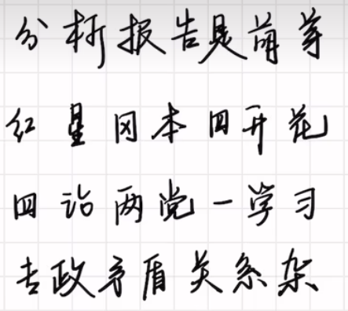

5 毛泽东思想形成发展过程

  
6 推动高质量发展

7

10 帝国主义未能灭亡中国的
根本原因：中华民族进行的不屈不挠的反侵略斗争。
重要原因：帝国主义列强之间的矛盾。（就是他们之间谁瓜分我们多了别的都不愿意，互相制衡）

13 主要矛盾变化

14 建设中国特色社会主义法制体系

15 思政建设

22 论十大关系标志了毛泽东为代表的中国共产党人开始探索适合中国国情的的社会主义建设道路

25 新时代我国民主政治领域具有重大创新意义的标志成果是：全过程人民民主。