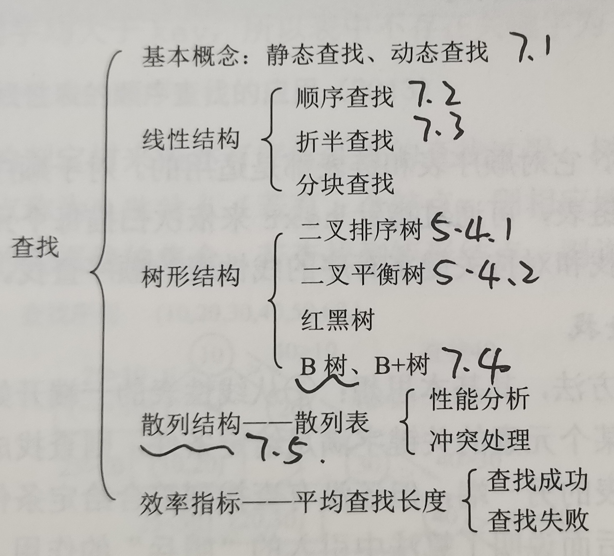
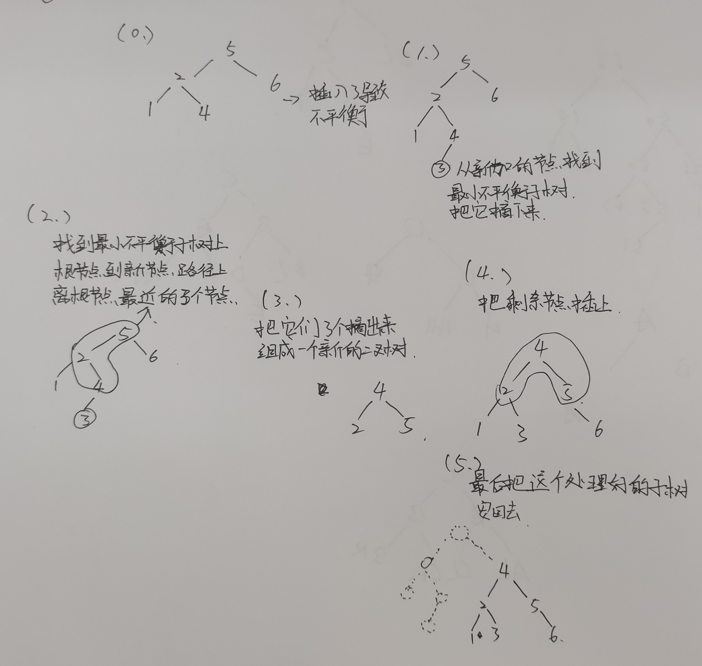
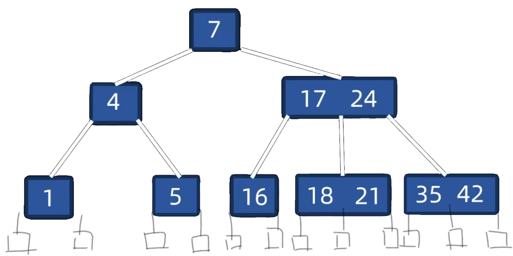

# 查找

### 基本概念
- 查找：在一堆同类的数据中找想找的数据，有成功和失败两种可能。
- 查找表：那堆数据就是查找表。查找表有增删改查操作。
- 静态查找表：就是只能查不能增删改的查找表。
- 关键字：类似于sql里面id一样，类似于学生的学号。主键，唯一标识一条数据。
- 查找长度：查找一个元素需要比较的次数。
- 平均查找长度：每个元素的查找长度对他被查找的概率加权求平均。等于长度乘以概率球和。$\sum PiCi$

---
### 顺序查找
就是一个线性的表，从前到后查找，如果这个线性表是个有序的，那可以找到比这个元素大了就认为查找失败了，不然得找到最后一个。没什么可说的。

---
### 折半查找（二分）
就是一个有序的线性表，从中间开始找，看大小，如果大了就从右边继续中间找，小了就从左边中间找。
有low mid high三个位置，指向三个元素，low是最小的，high是最大的，mid是中间，如果中间不能正好把偶数个元素分到两边，那就可以指向中间偏左一点，或者中间偏右一点，但在一次二分查找的时候不能有时候放左边有时候放右边。
比如说中间的元素比要找的大，那就把high指向中间的那个的前一个。
同理不然就把low指向中间的后一个。

### 二分查找的二叉判定树
就是不断的把中间的元素作为根节点  
左边那半的作为左子树  
右边那半作为右子树。

> **重要**：当中间元素是往左一点的时候左子树元素个数一定等于或者比右子树的元素个数少1  
> 同理 中间元素是往右一点的时候左子树元素个数一定等于或者比右子树的元素个数多1  
---
### 二叉排序树(BST)
就是左子树的所有节点都比根小  
右子树所有节点都比根大  
左右子树具有同样性质。  
结果就是他的中序遍历是按元素大小顺序来的。
但是有个问题，这种二叉树可能插插删删的**形状就不好了**，变得很高，不用管，因为他只是个二叉排序树而已。直接按照规则插入和删除就行。
查找什么的就更简单了。

---
### 平衡二叉树(AVL)
刚才说二叉排序树有一些问题，导致二叉排序树有点不优雅。所以平衡二叉树能解决此类问题。  
> 平衡二叉树是自己以及所有子树的左右子树高度相差不超过1的二叉排序树。
##### 平衡因子的计算
左子树的高度 - 右子树的高度
叶子节点也有平衡因子，并且是0，因为他的左右子树高度都是0，0-0=0。
##### 插入 调整

##### 构造
如果构造时候给的序列是无序的，那就一直直接插入调整插入调整。
##### 删除
删除之后的调整跟插入之后的调整查不太多。  
就是找到最小的那个不平衡的子树，找一个最深的节点到子树根节点，离根节点最近的三个节点调成平衡。之后跟插入之后的调整一样了。

---
### B树(B-树(这个-只是个破折号))
- 节点：每个方框就是一个节点
- 元素：方框里面那些数字就是元素
- 叶节点：就是最底下那层手画的节点，不带信息。他们是查找失败的节点。  

B树是一个类似于排序树的m叉树，每个节点里面有多个元素，每个元素是按照顺序排列的。n个元素有n+1个子树，并且每个子树里面所有元素的值大小都在两边的父元素中间。

m叉B树有如下要求：
- 根节点至少有一个元素，最多有 m-1 个元素
- 非根节点至少有 (m/2向上取整 - 1) 个元素，最多有 m-1 个元素
- 非叶节点有元素数量+1个子树
- 叶节点都在同一层

##### 插入
如果在插入之后，某个节点里面的元素数量超过了限制(比如说5叉树节点里面有5个元素)，就要把中间的(正中间或者偶数个元素就偏左一点)的那个元素移到他的父节点里面，之后把这个节点分裂成两个作为那个中间元素的左右子树。  
之后循环如此判断父节点是否元素数量也超过了限制，超过了就继续对父节点也执行此操作。

##### 删除
删除的如果是分支节点里面的元素，那就去子节点里面拿一个后继上来替代他  
比如想删除7，那就拿17替他，之后17那个位置用18替。相当于删除了个叶子节点里面的元素。
删除叶子节点之后要判断节点里面的元素之后，如果节点里面的元素个数低于最小值那就：
- 如果兄弟节点里面的元素够用就从兄弟节点借一个元素：
  - 从左兄弟借的话，就是把左父元素拿过来，把左兄弟的最后一个元素作为新的左父元素。
  - 从右兄弟借同理。
- 兄弟节点都不够借了，那就合左兄弟或者右兄弟，因为他们不够借了，所以合并之后新节点的元素数量肯定不到上限。比如说合并左兄弟，就是拼接左兄弟 左父元素 自己，作为一个新的节点。

---
### 散列表(也叫 哈希表 或 Hash表)
就是关键字存放的地址就等于他的哈希值，要存放或者查找关键字，直接计算出他的地址，上指定地址里面找关键字了，这样时间复杂度比那些要比较很多次才能查询的表低多了。基本上就O(1)，不然也不会多多少。

##### 散列(哈希)函数
通过关键字的值x计算出来他的哈希值H的函数。
- 直接定址：就是H = ax + b (a b 常数)哈希跟关键字是线性的。不会冲突。
- 除数留余：H = x % p (p 常数 % 模 余数)
- 数字分析：关键字的二进制某些位可能只有几个值（随机性较小），某些位可能有全部值（随机性较大），应当使用那些随机性较大的位计算哈希值。
- 平方取中法：取$x^2$的某些位，多少位视情况而定

##### 冲突处理
不同的关键字可能具有同样的哈希值，例如如果除数留余的话，除10，那么1和11具有同样的哈希值1。
1. 开放定址法：就是遇到冲突了之后想办法计算出一个新的地址。新的地址等于原来计算出来的地址+一个偏移d的和 对整个空间长度m取余数,i是冲突的次数  
$H_i = \left( (H + d_i) \mod m \right)$  
取余数的原因是因为如果新的地址计算出来如果超过了整个地址的最大值会从0开始的。
   - 线性探测：如果当前地址被占用了就往后找，d = 1,2,...m-1，往后找m-1个地址（如果找到储存空间的末尾就从0继续）
   - 平方探测：$d_i = 1^2,-1^2,2^2,-2^2...(m/2)^2$
   - 双散列法：$d_i = i*H_2$， $H_2$是第二个哈希函数，就是说如果冲突了就使用第二个冲突函数乘以冲突次数计算出新的地址的偏移量。
   - 伪随机序列法：一开始先生成一个随机数序列，之后$d_i$ = 随机数序列。
2. 链接法(拉链法)：就是每个地址下面下挂一个链表或者二叉树啥的。如果哈希有冲突了，那就这个地址下面的链表挂着，也不用计算新的地址了。这种方法太优雅了，时间复杂度很低！java里面有个什么map的子类就是用这个实现的。