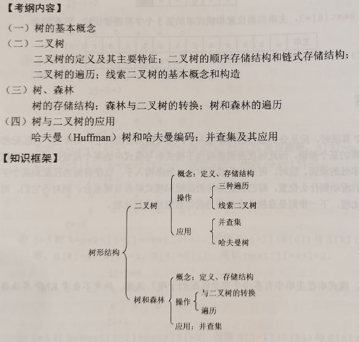
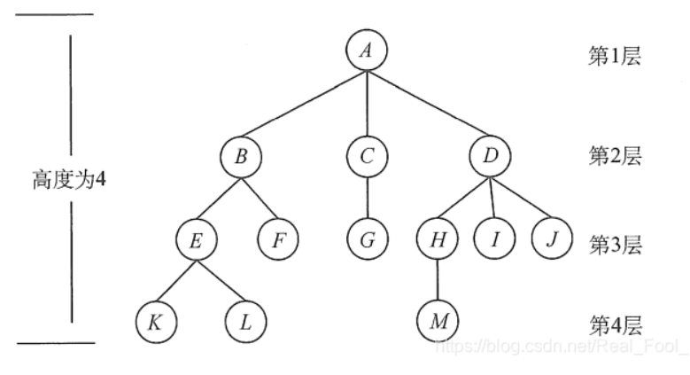
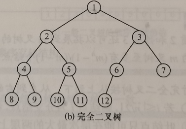
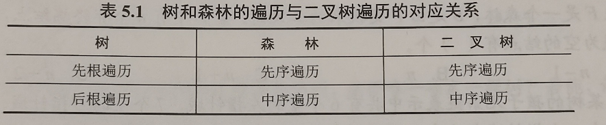

# 树的基本概念

- **树**：长成这样的就是树。
- **空树**：一棵树可以有0个节点，有0个节点的树就叫做空树。一棵树也可以只有一个节点。

## 术语

- 祖先、子孙、双亲、孩子、兄弟、堂弟：略
- **节点的度**：一个节点孩子的数量。
- **树的度**：树里面度最多的节点的度就是树的度。
- **分支节点**：度为不为0的节点。
- **叶节点**：度为零的节点。
- **有序树**：一个节点的不同孩子或子树之间存在顺序。
- **无序树**：跟有序树正好相反。
- **路径**：两个节点之间的通路，并且只能从上到下。例如A到K的路径就是A-B-E-K。
- **路径长度**：经过的边的个数，例如A到K路径长度为3。
- **森林**：多棵不相关的树的集合。

> **重要：节点总数 = 所有节点的度数和 + 1 = 不同度数节点数量的和。**

# 二叉树

- **二叉树**：有左右两个孩子的树就叫二叉树（如果二叉树的某个节点只有一个孩子他也分左右）。二叉树可以是空二叉树（没有节点），也可以只有根节点。

## 特殊的二叉树

- **满二叉树**：不管他有多少层，每一层都放满了。
- **完全二叉树**：只有最后一层没满，且节点都在这一层的左边。

- **二叉排序树（二叉搜索树）**：一个节点的左子树上所有节点的值都小于自己，右子树上所有节点的值都大于自己，有一个重要的特点，就是二叉排序树中序遍历呈升序。
- **平衡二叉树**：任意一个节点（包括根节点）的左右子树高度相差不超过1。平衡因子 = 左子树的高度 - 右子树的高度
- **正则二叉树**：所有的节点度为0或2。

> 度为0的节点数量 = 度为2的节点数量 + 1

## 二叉树的存储结构

- **顺序存储**：n层的树要从根节点的位置开始把一个树上的所有位置从上到下从左到右放进一个数组里面。完全二叉树可以不用存最后一个节点以后的位置，因为其后面都是空节点了。不存在的节点要用空节点替代，因为顺序存储要靠这个存储位置关系。所以顺序存储比较适合满二叉树或者完全二叉树。对于不是这两种二叉树来说其信息密度可能有点低。因为要使用大量的空节点占位。
- **链式存储(二叉链表)**：每个元素存储其自己的值和左右子节点的指针。所有元素的空指针（缺失的子节点存的是空指针）加起来等于节点数量 + 1。
- **三叉链表**：每个元素还存了其父节点的指针。
- **线索二叉树**：由于链式存储里面空指针太多了，所以规定如果是空指针的话，那左边存前驱节点，右边存后继节点（x序遍历的顺序下某节点对应的前驱或者后继）。此外，有两个新的变量专门存左右变量里面存的是子节点还是前驱后继。所以线索二叉树分为：先/中/后序线索二叉树。

# 树(进阶版）

## 树的存储结构（常用，单还有更多）

- **双亲表示法**：使用一个数组存所有节点，每个节点里面存自己的数据和双亲的伪指针（双亲节点在数组中的下标）。
- **孩子表示法**：每个节点存一个子节点链表（链表的每个节点里面保存一个树的子节点的指针和下一个链表节点的指针）。
- **孩子兄弟表示法**：每个节点存两个指针，一个是其下一个兄弟的指针，一个是其第一个孩子的指针，可以使用这种方式把树变成二叉树。

## 树、森林、二叉树的相互转换

- 用孩子兄弟法，就可以以二叉树的结构存储多叉树。
- **树转二叉树**：所以树用孩子兄弟法转换为二叉树。仔细想一想就知道一棵树用孩子兄弟法转换为二叉树之后根节点一定无右子树（因为树的根节点一定无兄弟）。
- **森林转二叉树**：所以森林的每棵树转换成二叉树之后依次把编号更大的树作为编号更小的树的右子树，这样就能把一个森林转化成一个二叉树了。同理二叉树转树或者森林是前两个的逆过程。

## 树和森林的遍历

- **树的遍历**：只有先根遍历和后根遍历。跟二叉树的先序和后序遍历是一个道理不细说了。
- **森林的遍历**：森林有先序遍历和中序遍历（这个中序遍历我更喜欢称它为后序遍历，只是书上叫他中序遍历）。
  - **森林的先序遍历**：就是依次对每个树先序遍历。
  - **森林的中序遍历（我叫他后序遍历）**：就是依次对每个树进行后序遍历。因为其后序遍历结果等于转换成二叉树之后中序遍历的结果，所以书上叫他中序遍历。
  

这个图就是说如果这三者相互转化，那么表格里面横着对应的遍历方式得到的结果相等。
# 树与二叉树的应用
## 哈夫曼编码
在传送信息的时候需要对单位字符进行编码，但是普通的定长编码有点浪费空间，我们想能不能尽可能缩短一段字符编码成01串的长度？办法就是把出现频率高的字符编码短，出现频率低的编码长一点。这样编码之后的01串总长度就会有所缩短，这种编码方式叫做哈夫曼编码。对字符们进行编码之前先按照频率构建一棵哈夫曼树，之后按照哈夫曼树转换成哈夫曼编码。
## 哈夫曼树
一棵二叉树的每个叶节点的带权路径长度之和（WPL）最小的树就叫做哈夫曼树。
- **带权路径长度**：二叉树的叶节点要是带权的话，他的权重乘以他到根节点的路径长度（到根节点的路径长度就是到根节点经过的树枝个数）就是他的带权路径长度。
### 哈夫曼树的构建
1. 给定一些字符和他们出现的频率
2. 挑出最小的两个合成一个二叉树，根节点的大小就等于两个节点的和。
3. 再从这些字符和那些合成的树的根节点的数值里面挑两个最小的合成一个新的树。
4. 重复第3步直到只有一棵树了。
### 由哈夫曼树转构造哈夫曼编码
现有一个哈夫曼树，我们可以规定左子树是0右子树是1（随便怎么规定都行）之后把从根节点到字符上的01序列记录下来就是他的哈夫曼编码。很简单。
哈夫曼编码是一种前缀编码：由于采用不定长编码，所以有可能一个字符的编码是另一个字符编码的开头，比如说a:01,b:011,那我遇到一段序列011.....的时候就不知道是b+...还是a+1...了，这种产生的歧义不是前缀编码，前缀编码是能保证没有任意一个编码是另一个编码的开头。  

# 并查集

