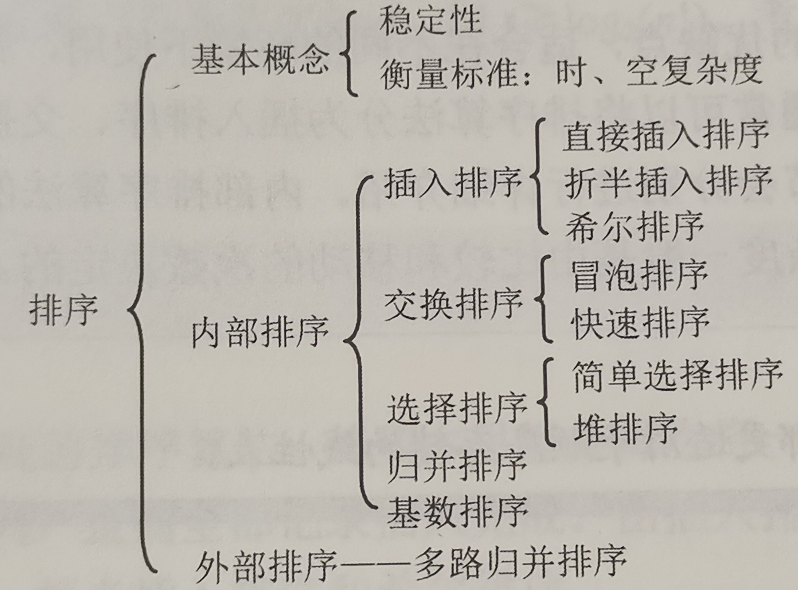

# 排序

- 排序：就是把一堆无序的元素给他变成有序的。
- 排序算法的**稳定性**：如果两个值相等的关键字在排序之后不会被调换顺序就说这个排序算法是稳定的。这个概念感觉不是太有用，**他不能衡量算法的好坏时间空间复杂度之类的**。
- 内部排序：排序时，元素都存在内存中，只操作内存。
- 外部排序：排序时，同时还得操作外存（硬盘什么的），元素不光存在内存中，比如说元素量实在太大了没法都加到内存里面，就得使用外部排序算法了。不过这个外部排序不在我要学的大纲里面。

### 大纲-内排序 
1. 排序的基本概念
2. 简单选择排序
3. 直接插入排序
4. 冒泡排序(bubble sort)
5. 希尔排序(shell sort)
6. **快速排序**
7. **堆排序**
8. **两路合并排序**(merge sort) 
9. 基数排序 
10. 各种内部排序算法的比较
11. 内部排序算法的应用

---
### 排序的基本概念
就是把一堆无序的元素给他变成有序的。排序分为两种排序。
- 内部排序：排序时，元素都存在内存中，只操作内存。
- 外部排序：排序时，同时还得操作外存（硬盘什么的），元素不光存在内存中，比如说元素量实在太大了没法都加到内存里面，就得使用外部排序算法了。不过这个外部排序不在我要学的大纲里面。**现在换学校了，现在又在了**

---
### 直接插入排序
第i次直接插入排序，前i个元素已经排好序了，只需要判断第i+1个元素放在哪里了就行了。从第i个元素开始往前找，找的时候同时把找过的元素往后串一个格。等到找到了合适的位置正好把那i+1放在这里。就像摸扑克牌一样，往后摸一张，把他找个地方。
##### 此算法的
- 空间复杂度：$O(1)$
- 时间复杂度
  - 最好$O(n)$
  - 最坏$O(n^2)$
  - 平均$O(n^2/4) = O(n^2)$
- 稳定

### 折半插入排序
那个插入的时候，先折半查找到应该插入的位置，之后把后面的元素统一往后串一个格。这个能稍微比直接插入排序快一点，但也没快到哪去。
##### 此算法的：
- 空间复杂度：$O(1)$
- 时间复杂度
  - 最好$O(n)$
  - 最坏$O(n^2)$
  - 平均$O(n^2/4) = O(n^2)$
- 稳定

---
### 冒泡排序
这个挺简单的，就是每次把第i个元素和第1+1个元素比较，把大的那个放在后面。i从0走到最后。如此进行一次之后能保证最后一个元素最大。第二次进行就不用i走到最后了，只要走到最后-1个，之后最后两个就能保证最大了。
##### 此算法的
- 空间复杂度：$O(1)$
- 时间复杂度
  - 最好$O(n)$
  - 最坏$O(n^2)$
  - 平均$O(n^2)$
- 稳定

---
### 希尔排序 T0
直接插入排序算法在整个元素比较有序的情况下，效率可以惊人的高！于是希尔排序，就是逐渐的先把整个序列先粗排变的比较有序再细排。是一个特别厉害的秒杀其他算法的算法。
具体就是先把元素分为4组（元素号i%4相等的元素是同一组，就是每隔三个分为一组，ABCDABCDABCD这么分，A的一组，B的一组，C的一组）每个组内分别执行插入排序。之后把元素分为两组（元素号i%2相等为同组。ABABABAB这么分）每个组内分别插入排序。最后所有元素一组执行一次插入排序。
##### 此算法的
- 空间复杂度：$O(1)$
- 时间复杂度
  - 最好$O(n)$
  - 最坏$O(n^2)$
  - 平均$O(n^{1.3})$
- 不稳定

---
### 快速排序
就是比较快速的算法，先在序列里面选定一个p，把比p小的都放到p左边，比p大的都放到右面。之后再对p左面和p右面的分别递归执行快速排序。
具体实现起来用快慢指针比较快，书上也是教的快慢指针。先把p选定为第0个元素，之后把i指向0，j指向最后一个元素。之后开始把j逐渐往前移动，直到找到一个比p小的，就让这个元素覆盖掉i位置的值（此时i位置是p，但是p已经记录下来了不怕覆盖。）之后让i往前后动直到找到比p大的，用他覆盖掉j的位置，之后再让j往前找比p小的，如此反复。最后i和j两个指针相遇了，就停止。把p写入他们相遇的位置，此时能保证这个位置左边都更小，右边都更大。最后两边分别递归快速排序。
##### 此算法的
- 空间复杂度：
  - 最好$O(n)$
  - 最坏$O(\log_2{n})$
- 时间复杂度
  - 最好$O(n)$
  - 最坏$O(n^2)$：当元素已经呈基本有序或者逆序的时候，解决办法是中分元素是随机选择的
  - 平均$O(n\log_2{n})$
- 不稳定

---
### 堆排序
大顶堆：就是根节点元素值大于其子树里面所有元素值的完全二叉树，其左右子树也分别是个大顶堆。
小顶堆：同理正好相反。
先把这个线性表当成一个完全二叉树，之后对其进行构造大顶堆（或者小顶堆）。大顶堆的第一个元素肯定是最大的，把他换到最后一个去，之后再次调整大顶堆，保证除了最后一个元素是一个大顶堆。之后把第一个换到倒数第二个.....
构造大顶堆：从第一半个元素往前开始构造，如果此元素的值比子元素里面某个小，就把把下沉成子节点，最大那个子节点上浮。此元素下沉到子节点之后可能还能下沉，那就递归下沉（或者不用递归其实也行）。我这个写的可能稍微有点乱，不然根据定义的话仔细思考一下也能知道怎么构建大顶堆。
