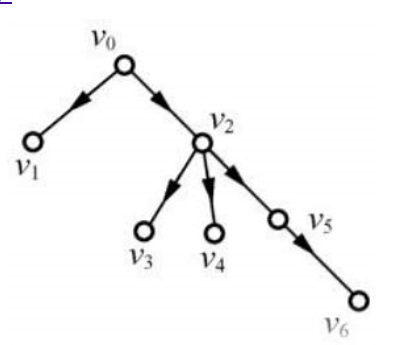

重要知识点放在前面：
无向图（边数2倍）=（顶点度数和）

* * *
图的基本概念：
- 图的定义：图G是由一个顶点集V和边集E组成的记作G = ( V , E ) |V| : 顶点个数 |E| : 边数。边的两头是要连接到顶点上的。
- 无向图：边就是一条没有方向的线，他的E集合长这样：E = {(1,2),(2,3),(3,4),...}，由于没有方向，(x,y)等价于(y,x)。
- 有向图：边是一条有方向的线，他的边集合E = {<1,2>,<2,1>,<3,2>,...}。
- 简单图：如果图满足**不存在重复边**和**不存在到自身的边**，就是简单图，重复边就是有两条一样的边。不满足就是**多重图**。之后默认讨论的是简单图。
- 完全图：一个有/无向图，如果其边达到能容纳的上限就是完全图。所以对于无向图任意两个节点之间都有一条边，有向图任意两个节点之间都有两条边。所以可以推出**无向完全图有n(n-1)/2条边，有向完全图有n(n-1)条边。**
- 子图：如果从一个图里面拿出来一部分节点和一部分边（不能随便拿）形成的图就是那个图的子图。
- 连通：**无向图**中两顶点之间有路径存在就是连通。
- 强连通：**有向图**中两个顶点ab，a到b和b到a都有路径就是强连通。
- 连通图：**无向图**中任意两个顶点是连通的就叫连通图。
- 强连通图：**有向图**中任意两个顶点是强连通的就叫强连通图。
- 连通分量：**无向图**中的**极大连通子图**。
- 强连通分量：**有向图**钟的**极大强连通子图**。
- 生成树（连通图的生成树）：连通图中**含有所有节点的极小连通图**，就是说尽可能去掉更多的边保留更少的边，还让他保持是连通的。因为极小，可见他不包含回路。
- 生成森林（非连通图图的生成森林）：可见，如果生成之前不是连通的就只能生成多个树了，那就是一个森林。
- 顶点的度：无向图中跟某顶点相连的边的数量是他的度。
- 顶点的入度，出度：同理，有向图中某顶点发出的边的数量就是他的出度，指向他的边的数量就是入度。
- 边的权和网：如果一个图每个边都有个权值，那么他就是个带权图，也叫网。
- 稠密图，稀疏图：边很多的图叫稠密图，边很少的图叫稀疏图。
- 路径长度：路径上边的数量就是路径长度。
- 回路：就是一个圈，走一圈经历了不同的顶点回到了出发点，那个路径就是回路。
- 简单路径：顶点不重复出现的路径
- 简单回路：除了第一个和最后一个顶点之外别的顶点都不重复出现的回路。
- 距离：两个顶点之间的最短路径长度。如果路径不存在距离是∞。
- 有向树：一个顶点入度为0剩下的入度都为1。

- AOV网：在一个有向无环图表示的工程步骤图里面，有个从A到B的路径，则说明A步骤必须在B步骤之前发生，B的发生是依赖于A已经发生完的。
---
图的存储：
- 无向图
  - 邻接矩阵
  - 邻接表
  - 邻接多重表
- 有向图
  - 邻接矩阵
  - 邻接表
  - 十字链表
具体内容暂时略
---
X

---
单源最短路径问题：
求一个图（有或无向）任意顶点vi距离给定顶点v0的最短路径（最短路径参照距离和路径长度定义）
这个图可以是带权图或者是不带权的图
### 不带权图求单元最短路径
使用广度优先算法，从v0开始生成的生成树就是广度优先生成树。这个生成树就是v0到其余顶点的最短路径了。
### 带权图求单源最短路径（没有负权）
##### Dijkstra(迪杰斯特拉)算法：
这个算法会存：
- 每个节点距离v0的距离，初始状态下v0距离v0的距离是0，其余都是∞  
- 每个节点是否已经是确定最短距离了，**当所有节点都确定是最短距离的时候**，算法结束。
- 每个节点的已知最短路径的前置节点

每一次循环会：
- 选择一个距离最短的节点作为已经确认最短路径的节点
- 计算**此节点**周围所有节点的距离并更新距离表。**旁边的节点**的最短距离要是得到更新了那就把他的最短路径前置节点设置为**此节点**
##### cc(丞丞)单源最短算法(现在往后学了一点发现其实是Floyd算法，因为是他先发明的)：
存：
- 一个队列
- 一个是否在队列中的状态标记数组
- 每个节点距离v0的距离数组
- 到v0已知的最短路径的前置节点。

初始的时候将v0入队，此后：
- 每次循环从队里面取出一个元素vi，计算vi周围所有的元素与v0的距离并更新距离和最短路径前置节点，之后入队（如果已经在队列里面了就不入队了）。
- 直到队列空了

---
### 拓扑排序
##### AOV网：
在一个有向无环**无权**图表示的工程步骤图里面，有个从A到B的路径，则说明A步骤必须在B步骤之前发生，B的发生是依赖于A已经发生完的。
##### 拓扑排序：
使用AOV网产生一个序列，使在AOV网中先发生的排在前面，后发生的排在后面。  
如何进行拓扑排序?  
重复找到入度为0的节点，输出他，然后删除此节点和与此节点相关的边。  
直到没有任何一个节点。
##### 拓扑排序找环路  
拓扑排序可以用来求是否有环路：  
重复找到入度为0的节点并删除他的时候
如果有一个时刻，网不为空（里面还存在节点和边），但是已经没有入度为0的节点了那就是存在环路。
