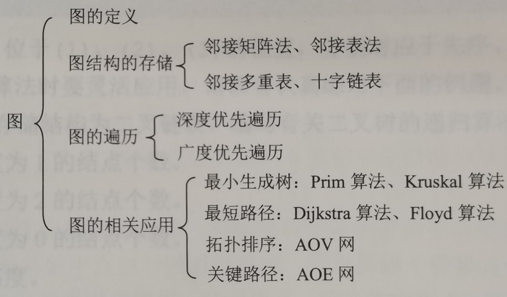

重要知识点放在前面：
无向图（边数2倍）=（顶点度数和）

---
图的基本概念：
- 图的定义：图G是由一个顶点集V和边集E组成的记作G = ( V , E ) |V| : 顶点个数 |E| : 边数。边的两头是要连接到顶点上的。
- 无向图：边就是一条没有方向的线，他的E集合长这样：E = {(1,2),(2,3),(3,4),...}，由于没有方向，(x,y)等价于(y,x)。
- 有向图：边是一条有方向的线，他的边集合E = {<1,2>,<2,1>,<3,2>,...}。
- 简单图：如果图满足**不存在重复边**和**不存在到自身的边**，就是简单图，重复边就是有两条一样的边。不满足就是**多重图**。之后默认讨论的是简单图。
- 完全图：一个有/无向图，如果其边达到能容纳的上限就是完全图。所以对于无向图任意两个节点之间都有一条边，有向图任意两个节点之间都有两条边。所以可以推出**无向完全图有n(n-1)/2条边，有向完全图有n(n-1)条边。**
- 子图：如果从一个图里面拿出来一部分节点和一部分边（不能随便拿）形成的图就是那个图的子图。
- 连通：**无向图**中两顶点之间有路径存在就是连通。
- 强连通：**有向图**中两个顶点ab，a到b和b到a都有路径就是强连通。
- 连通图：**无向图**中任意两个顶点是连通的就叫连通图。
- 强连通图：**有向图**中任意两个顶点是强连通的就叫强连通图。
- 连通分量：**无向图**中的**极大连通子图**。
- 强连通分量：**有向图**钟的**极大强连通子图**。
> - 生成树（连通无向图的生成树）：连通图中**含有所有节点的极小连通图**，就是说尽可能去掉更多的边保留更少的边，还让他保持是连通的。因为极小，可见他不包含回路。
- 生成森林（非连通无向图的生成森林）：可见，如果生成之前不是连通的就只能生成多个树了，那就是一个森林。
- 顶点的度：无向图中跟某顶点相连的边的数量是他的度。
- 顶点的入度，出度：同理，有向图中某顶点发出的边的数量就是他的出度，指向他的边的数量就是入度。
- 边的权和网：如果一个图每个边都有个权值，那么他就是个带权图，也叫网。
- 稠密图，稀疏图：边很多的图叫稠密图，边很少的图叫稀疏图。
- 路径长度：路径上边的数量就是路径长度。
- 回路：就是一个圈，走一圈经历了不同的顶点回到了出发点，那个路径就是回路。
- 简单路径：顶点不重复出现的路径
- 简单回路：除了第一个和最后一个顶点之外别的顶点都不重复出现的回路。
- 距离：两个顶点之间的最短路径长度。如果路径不存在距离是∞。
- 有向树：一个顶点入度为0剩下的入度都为1。

- AOV网：在一个有向无环图表示的工程步骤图里面，有个从A到B的路径，则说明A步骤必须在B步骤之前发生，B的发生是依赖于A已经发生完的。
---
图的存储：
- 无向图
  - 邻接矩阵
  - 邻接表
  - 邻接多重表
- 有向图
  - 邻接矩阵
  - 邻接表
  - 十字链表
具体内容暂时略
---
### 图的遍历：
#### 广度优先遍历(Breadth First Search,BFS)：
就类似于树的层序遍历，访问一个节点，然后访问这个节点没被访问过的所有子节点，然后访问所有没被访问过的孙子节点....  
```
有一个队列，里面存了下一个要访问的节点队列。
开始的时候先往队列里面放一个开始节点，广度优先遍历将从此节点开始。
之后循环的从队列里面取出一个节点进行如下操作：
1.访问此节点，把这个节点标记为以访问
2.访问此节点的所有没访问过的子节点然后入队。
```
这个可以用来求不带权图的单源最短路径问题，就是从一个节点开始，到所有节点的最短路径。
  
#### 深度优先遍历(Depth First Search,BFS)：
深度遍历，就是先输出此节点，之后对所有没访问过的子节点递归深度遍历。

#### 不连通
对于图不连通的情况下仅从一个节点开始进行深度或者广度优先遍历可能会遍历不到所有节点，这样可以添加一个外层循环，对每个未访问过的节点执行遍历。确保每个节点被访问一次。

---
### 求最小生成树：
求一个带权连通图的所有生成树之中权值和最小的那个（生成树前面定义有）
##### 普利姆(Prim)算法
**从一个节点开始**，找出他连的权值最小的边的节点，之后重复在不形成环的前提下重复找出连的权值最小的边的节点，直到找齐所有节点。
##### 克鲁斯卡尔(Kruskal)算法
找出所有边中权值最小的边和他两边的节点，之后重复在不形成环的前提下这么找边和节点，直到找齐所有的节点。

---
单源最短路径问题：
求一个图（有或无向）任意顶点vi距离给定顶点v0的最短路径（最短路径参照距离和路径长度定义）
这个图可以是带权图或者是不带权的图
### 不带权图求单元最短路径
使用广度优先算法，从v0开始生成的生成树就是广度优先生成树。这个生成树就是v0到其余顶点的最短路径了。
### 带权图求单源最短路径（没有负权）
##### Dijkstra(迪杰斯特拉)算法：
这个算法会存：
- 每个节点距离v0的距离，初始状态下v0距离v0的距离是0，其余都是∞  
- 每个节点是否已经是确定最短距离了，**当所有节点都确定是最短距离的时候**，算法结束。
- 每个节点的已知最短路径的前置节点

每一次循环会：
- 选择一个距离最短的节点作为已经确认最短路径的节点
- 计算**此节点**周围所有节点的距离并更新距离表。**旁边的节点**的最短距离要是得到更新了那就把他的最短路径前置节点设置为**此节点**

##### Floyd算法：
 https://www.bilibili.com/video/BV1tQ4y147pw/?share_source=copy_web&vd_source=aed87d0a8ffe56c387803147a85b55fd
##### cc(丞丞)单源最短算法：
存：
- 一个队列
- 一个是否在队列中的状态标记数组
- 每个节点距离v0的距离数组
- 到v0已知的最短路径的前置节点。

初始的时候将v0入队，此后：
- 每次循环从队里面取出一个元素vi，计算vi周围所有的元素与v0的距离并更新距离和最短路径前置节点，之后入队（如果已经在队列里面了就不入队了）。
- 直到队列空了

---
### 拓扑排序
##### AOV网：
在一个**有向无环无权图**表示的工程步骤图里面，有个从A到B的路径，则说明A步骤必须在B步骤之前发生，B的发生是依赖于A已经发生完的。
##### 拓扑排序：
使用AOV网产生一个序列，使在AOV网中先发生的排在前面，后发生的排在后面。  
如何进行拓扑排序?  
重复找到入度为0的节点，输出他，然后删除此节点和与此节点相关的边。  
直到没有任何一个节点。
##### 拓扑排序找环路  
拓扑排序可以用来求是否有环路：  
重复找到入度为0的节点并删除他的时候
如果有一个时刻，网不为空（里面还存在节点和边），但是已经没有入度为0的节点了那就是存在环路。  
**深度优先遍历**和**求关键路径**同样能找出环路

---
### 关键路径
##### AOE网：
一种**带权有向无环图**  ，每个事件的发生依赖于前面的活动的完成。
区别：AOV网只能表示一个项目每个步骤的依赖关系，AOE网还可以表示每一步用的时间。  
- 事件：节点，网中的每个节点代表一个事件，事件的发生是瞬间的不需要时间。
- 活动：边，网中的边代表一个活动，边的权重代表了这个活动花费的时间。
- 源点：整个工程开始的节点，即入度为0的节点。
- 汇点：整个工程结束的节点，即出度为0的节点。
- 关键路径：由于每个事件的发生需要前面所有事件和活动的完成，所以整个项目中最慢的那条路径必须保证一刻也不能停，这条路径一旦耽误一点，就会导致整个完工的时间延期。这条路径就是关键路径。所以，可能别的路径上的事件或者活动晚发生一会也不会耽误完工的时间。
- 事件的最早发生时间：如果前面的事件跟活动都没耽误，这个事件最早能发生的时间，就是最早发生时间，就是**源点到此点的最短路径时间**。记作**ve(k)**。v是节点的意思，e是early的意思，l是late的意思。
- 事件的最晚发生时间：这个事件能拖多长时间不耽误最终完工的时间，这个时间是根据结束的时间倒推回来的。**vl(k)**。
- 活动的最早开始时间：就是他前面的事件的最早发生时间，因为事件发生完了他就能开始。**记作e(i)**。
- 活动的最晚开始时间：是根据后面节点的最晚发生时间算出来的，记作**l(i)**。
- 机动时间：一个活动或者事件，它可以拖多长时间不影响工期。
